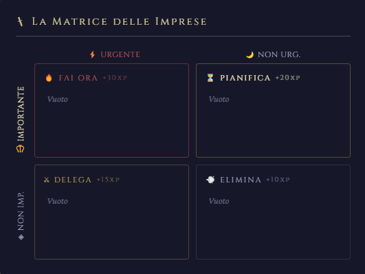
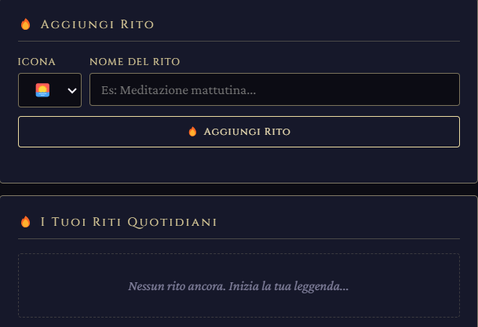
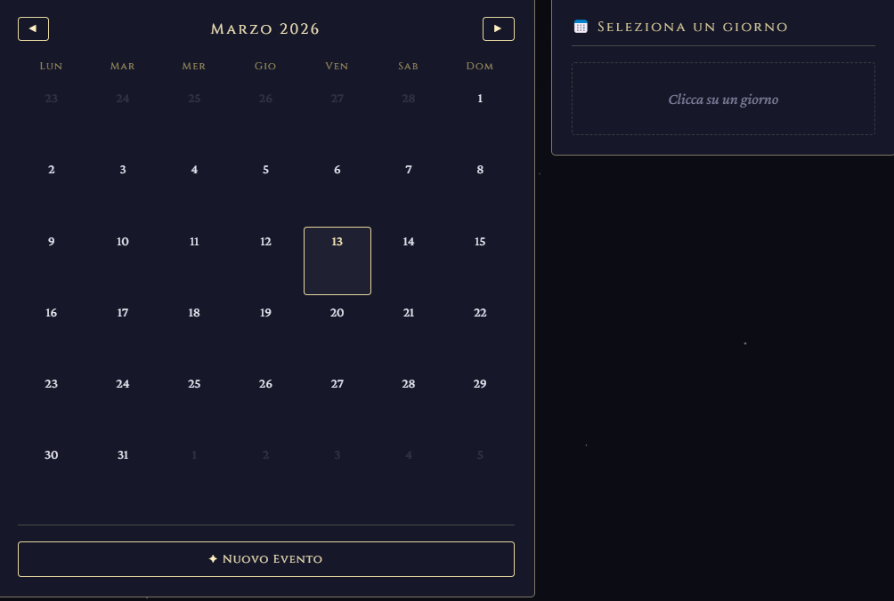

# ⚔️ QuestLog
**QuestLog** è un'app di produttività con ambientazione fantasy — trasforma le tue attività quotidiane in quest, costruisci abitudini con streak di fuoco, e sali di livello completando imprese.


---

## ✨ Funzionalità

- **Quest con Matrice di Eisenhower** — organizza i compiti in 4 quadranti, ognuno con XP diversi
- **Riti Quotidiani** — aggiungi le tue abitudini, spuntale ogni giorno, costruisci streak. Streak di 7+ giorni danno XP bonus
- **Calendario con eventi** — crea eventi con colore personalizzato e ripetizione 
- **Sistema XP e Livelli** — 10 livelli da *Apprendista* a *Dio delle Imprese*, con level-up animato
- **7 Temi** — uno per ogni classe eroica: Guerriero, Mago, Ranger, Paladino, Ladro, Druido, Bardo
- **Cronache** — storico completo di tutte le imprese completate
- **Salvataggio su file** — i dati vengono salvati localmente nella cartella utente, non nel browser

## 🎨 Temi disponibili

| Tema | Classe | Colori | 
|------|--------|--------|
| Guerriero | ⚔️ | Ambra e rosso scuro |
| Mago | 🧙 | Viola arcano |
| Ranger | 🏹 | Verde foresta |
| Paladino | 🛡️ | Argento celestiale |
| Ladro | 🗡️ | Teal e ombra |
| Druido | 🌿 | Arancio terra |
| Bardo | 🎵 | Magenta e rosa |


## 🖥️ Screenshot

| Quest | Riti | Calendario |
|-------|------|------------|
|  |  |  |


## 🚀 Installazione
### Esegui da sorgente
#### Prerequisiti
- [Node.js](https://nodejs.org/) v18 o superiore
- npm (incluso con Node.js)
Verifica di averli installati:
```bash
node --version   
npm --version    
```
#### Clona e avvia
```bash
# 1. Clona il repository
git clone https://github.com/TUO-USERNAME/questlog.git
cd questlog

# 2. Installa le dipendenze
npm install

# 3. Avvia l'app
npm start
```

L'app si aprirà come finestra nativa sul tuo desktop.


## 📦 Build — crea l'eseguibile
Per produrre un installer distribuibile:

```bash
# Windows → dist/QuestLog Setup x.x.x.exe
npm run build:win

# macOS → dist/QuestLog-x.x.x.dmg
npm run build:mac

# Linux → dist/QuestLog-x.x.x.AppImage
npm run build:linux
```

I file finali si trovano nella cartella `dist/`.

## 🛠️ Tecnologie

- **[Electron](https://www.electronjs.org/)** — framework per app desktop cross-platform
- **HTML / CSS / JavaScript** — nessun framework frontend, tutto vanilla
- **[electron-builder](https://www.electron.build/)** — packaging e distribuzione


<div align="center">
  <sub><em>May your conquests be ever fruitful</em></sub>
</div>
